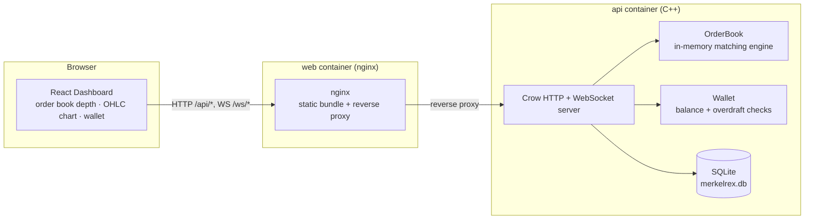

# Merkelrex

A C++ cryptocurrency exchange simulator: an in-memory order-matching engine backed by SQLite for wallet/trade persistence, exposed over a REST + WebSocket API, with a React dashboard for live order book depth, OHLC charts, and wallet management.

Originally built as a university assignment (a CSV-driven CLI order book), then rebuilt with a proper matching engine, a persistence layer, a web API, a live dashboard, an automated test suite, and a containerized deployment.

## Architecture



- **Matching engine** (`OrderBook`/`OrderBookEntry`): fills incoming orders against the best available opposing price(s), partially or fully, and rests any unfilled remainder.
- **Wallet**: tracks per-user balances across arbitrary currency pairs, converts both legs of a trade (base and quote), and rejects orders that would overdraft a balance.
- **Persistence**: SQLite for users, wallet balances, and settled trades; the historical CSV dataset seeds the book's initial resting liquidity.
- **API**: a Crow (C++) server exposing REST endpoints for the wallet, order book depth, order placement, and OHLC analytics, plus a WebSocket feed for live ticker/fill updates.
- **Frontend**: a Vite/React dashboard, served by nginx in production, which also reverse-proxies `/api` and `/ws` to the backend.

## Running it

**Production** (single command, builds and runs both containers):
```bash
docker compose up --build
```
Then open the app on the published port (`3000` by default — see `docker-compose.yml`).

**Development** (hot-reload for both the frontend and backend):
```bash
docker compose -f docker-compose.base44.yml up
```

## Testing

GoogleTest suite covering the matching engine and wallet:
```bash
cmake -B build -S .
cmake --build build -j$(nproc)
ctest --test-dir build --output-on-failure
```

Coverage includes:
- **Partial fills** — an incoming order smaller than resting liquidity, larger than resting liquidity, crossing multiple price levels, matching against historical dataset rows, and no-liquidity cases.
- **Multi-asset conversions** — non-USDT pairs (`ETH/BTC`, `DOGE/BTC`) and a chained `ETH → BTC → USDT` scenario, verifying both legs of each trade convert correctly.
- **Wallet overdraft protection** — insufficient-balance withdrawals fail without mutating the balance, exact-balance withdrawals succeed and zero out, and `canFulfillOrder` correctly rejects both over-large bids and asks.

These also run automatically as part of the production Docker build (`Dockerfile`) — a broken test fails the image build.

## Latency benchmark

`bench/latency_bench.cpp` fires synthetic crossing orders at `OrderBook::matchNewOrder` and measures per-order fill latency:
```bash
./build/latency_bench <num_orders>
```

Measured on a 2-core Codespaces devcontainer:

| Orders matched | Mean | p50 | p95 | p99 | Max |
|---:|---:|---:|---:|---:|---:|
| 1,000  | 8.80 us  | 5.82 us   | 26.61 us  | 38.12 us   | 87.40 us   |
| 5,000  | 67.33 us | 47.00 us  | 202.88 us | 254.04 us  | 703.34 us  |
| 20,000 | 395.37 us | 309.90 us | 996.12 us | 1,222.98 us | 9,509.78 us |

Latency grows faster than order count — not just because more orders are being matched, but because each match walks the resting book with a linear scan (`std::vector`), so per-match cost grows as the book gets deeper. At the scale of this project's dataset that's still comfortably sub-millisecond at p50, but it's the clear next optimization target: indexing resting orders by price level (e.g. a `std::map<price, ...>` per side) would turn that linear scan into a logarithmic one.

## Live demo

<!-- TODO: add a deployed link or a short screen recording here -->

## Tech stack

C++17 · Crow · SQLite3 · GoogleTest · CMake · React · TypeScript · Vite · Docker